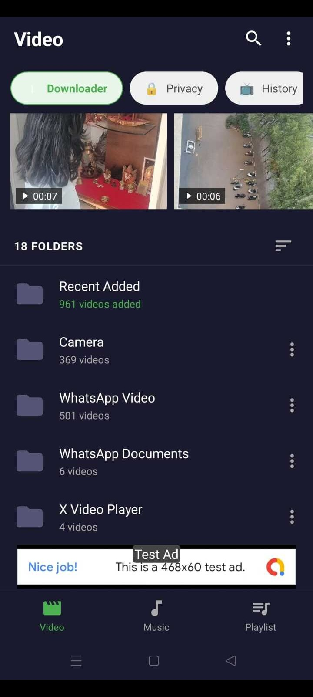
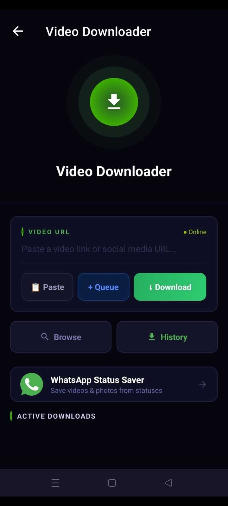
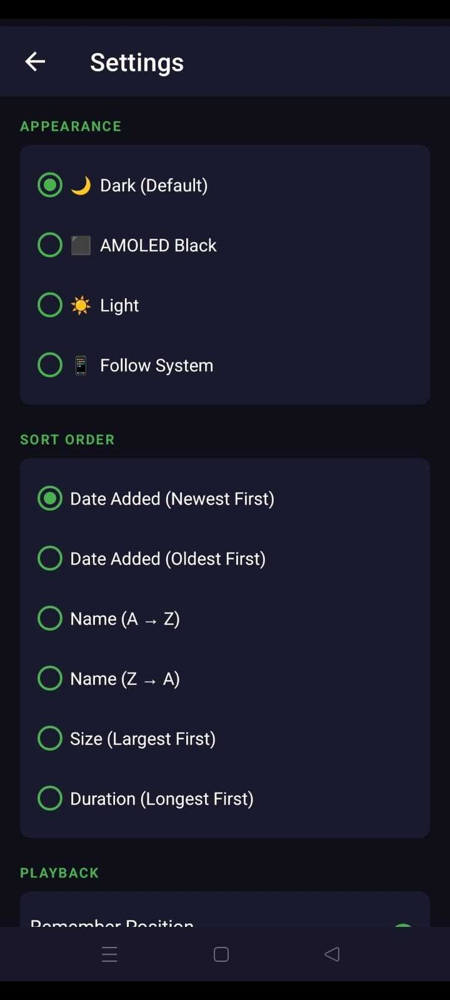
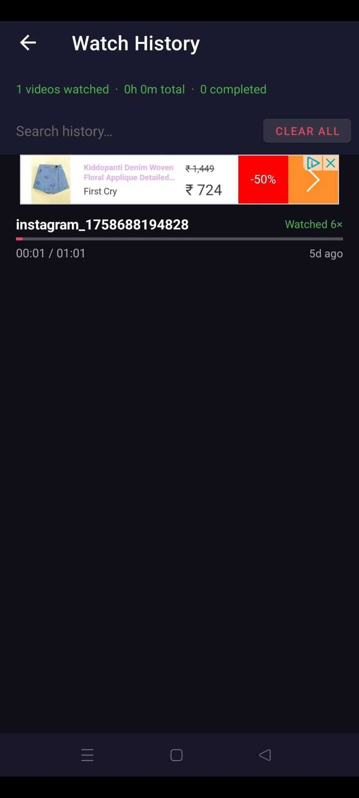
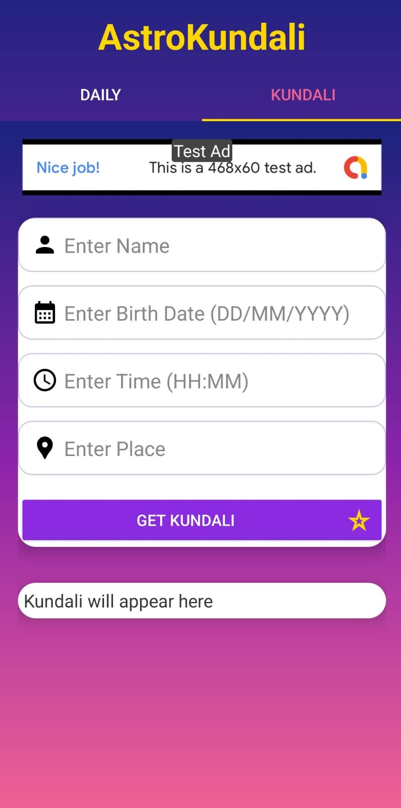
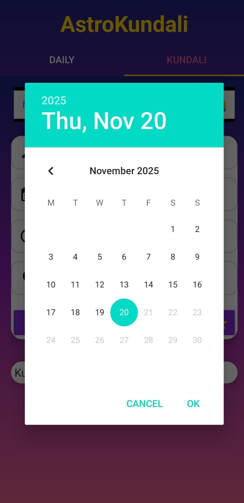
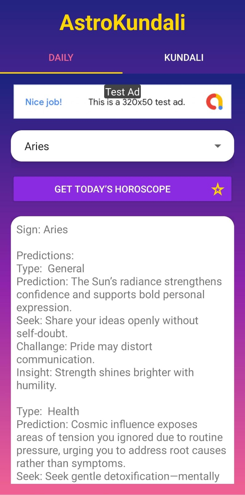

# Hetal Hapani
### Android Java Developer

---

## About Me

Android Java Developer with hands-on experience building and publishing real-world applications on Google Play. I specialize in developing clean, maintainable apps with Firebase backends, REST API integration, AdMob monetization, and full lifecycle management from development to store deployment.

- **5 Published Apps** on Google Play
- Experience with **Firebase**, **REST APIs**, **AdMob**, and **SQLite/Room**
- Full **Google Play Console** deployment experience

---

## Skills

---

## Published Applications

### 1. Video Player Downloader

> A feature-rich media player and video downloader with a clean, user-friendly interface.

**Features:**
- Video playback with multiple format support
- Media file management
- Intuitive and responsive UI
- Smooth performance across devices

**Tech Stack:**

| Technology | Purpose |
|---|---|
| Java | Core development |
| Android SDK | UI & media components |
| REST APIs | Video source integration |

**Screenshots:**

<table>
  <tr>
    <td></td>
    <td></td>
    <td></td>
    <td></td>
  </tr>
</table>

---

### 2. Flexora Fitness — Fitness At Home

> A complete home workout companion with guided exercise plans and fitness tracking.

**Features:**
- Home workout plans for all fitness levels
- Exercise tracking and progress monitoring
- Detailed exercise guides
- AdMob-integrated monetization

**Tech Stack:**

| Technology | Purpose |
|---|---|
| Java | Core development |
| Firebase | User data & authentication |
| Room Database | Local data storage |
| AdMob | In-app monetization |

**Screenshots:**

<table>
  <tr>
    <td></td>
    <td></td>
    <td></td>
  </tr>
</table>

---

### 3. AstroKundali — Horoscope Plus

> A daily horoscope and astrology app delivering personalized astrological content.

**Features:**
- Daily horoscope for all zodiac signs
- Astrology predictions and insights
- Personalized content feed
- Clean and engaging UI

**Tech Stack:**

| Technology | Purpose |
|---|---|
| Java | Core development |
| REST APIs | Astrology content delivery |
| Firebase | Analytics & notifications |

**Screenshots:**

<table>
  <tr>
    <td></td>
    <td></td>
    <td></td>
    <td></td>
  </tr>
</table>

---

### 4. AI Prompt House

> A curated AI prompt library to help users explore and manage AI-generated content prompts.

**Features:**
- Large library of categorized AI prompts
- Browse by topic and use case
- Save and manage favourite prompts
- Lightweight and fast

**Tech Stack:**

| Technology | Purpose |
|---|---|
| Java | Core development |
| REST APIs | Prompt content delivery |

**Screenshots:**

<table>
  <tr>
    <td></td>
    <td></td>
    <td></td>
    <td></td>
    <td></td>
  </tr>
</table>

---

### 5. PDF Converter

> A simple and reliable tool for creating and converting documents to PDF on Android.

**Features:**
- Create PDFs from images and text
- Document conversion and management
- File sharing support
- Clean minimal interface

**Tech Stack:**

| Technology | Purpose |
|---|---|
| Java | Core development |
| Android SDK | File & document APIs |

**Screenshots:**

<table>
  <tr>
    <td></td>
    <td></td>
    <td></td>
    <td></td>
  </tr>
</table>

---

## Services

I am available for freelance Android development work:

| Service | Description |
|---|---|
| Android App Development | Build new Android apps from scratch in Java |
| Bug Fixing & Debugging | Diagnose and fix issues in existing Android apps |
| Firebase Integration | Auth, Firestore, Realtime DB, Cloud Messaging |
| REST API Integration | Connect Android apps to any backend or third-party API |
| AdMob Setup | Banner, interstitial, and rewarded ad integration |
| Google Play Publishing | App submission, ASO, and release management |
| App Maintenance | Ongoing updates, SDK upgrades, and performance improvements |

---

## Statistics

| Stat | Value |
|---|---|
| Published Apps | 5 |
| Primary Language | Java |
| Monetization | AdMob |
| Backend Experience | Firebase |
| Store | Google Play |

---

## Contact

| Platform | Link |
|---|---|
| GitHub | [github.com/parthavihapani](https://github.com/parthavihapani) |
| LinkedIn | [linkedin.com/in/hetal-hapani-25b0aa101](https://www.linkedin.com/in/hetal-hapani-25b0aa101/) |
| Email | [hetalmeruliya0729@gmail.com](mailto:hetalmeruliya0729@gmail.com) |

---

  Open to freelance projects and full-time Android development opportunities.

